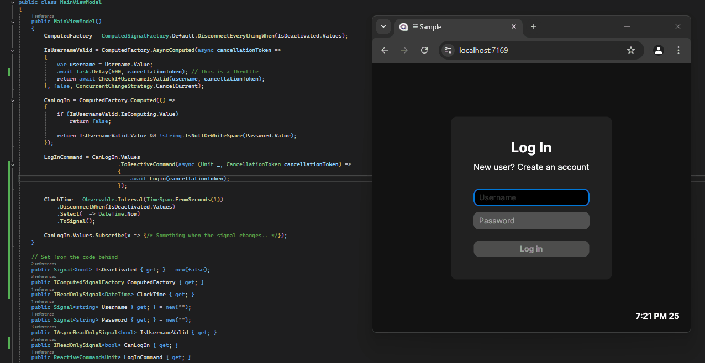

# Nuget https://www.nuget.org/packages/SignalsDotnet

    # Angular Signals for .Net
This library is a porting of the Angular Signals in the .Net World, adapted to the .Net MVVM UI Frameworks and based on [R3](https://github.com/Cysharp/R3) (variant of ReactiveX).
If you need an introduction to what a signal is, try to see: https://angular.io/guide/signals.

# Get Started
It is really easy to get started. What you need to do is to replace all binded ViewModel Properties and ObservableCollections to Signals:

## Example 1
```c#
 public class LoginViewModel
 {
     public LoginViewModel()
     {
         CanLogin = Signal.Computed(() => !string.IsNullOrWhiteSpace(Username.Value) && !string.IsNullOrWhiteSpace(Password.Value));
         LoginCommand = new DelegateCommand(Login, () => CanLogin.Value).RaiseCanExecuteChangedAutomatically();
     }

     public Signal<string> Username { get; } = new();
     public Signal<string> Password { get; } = new();
     public IReadOnlySignal<bool> CanLogin { get; }

     public ICommand LoginCommand { get; }
     public void Login() { /* Login */ }
 }

public static class DelegateCommandExtensions
{
    // This is specific for Prism, but the same approach can be used in other MVVM Frameworks
    public static T RaiseCanExecuteChangedAutomatically<T>(this T @this) where T : DelegateCommand
    {
        var signal = Signal.Computed(@this.CanExecute, config => config with { SubscribeWeakly = false });
        signal.Subscribe(_ => @this.RaiseCanExecuteChanged());
        _ = signal.Value;
        return @this;
    }
}
```

## Example 2
```c#
public class LoginViewModel : IActivatableViewModel
{
    // Value set from outside.
    public Signal<bool> IsDeactivated { get; } = new(false);
    public LoginViewModel()
    {      
        var computedFactory = ComputedSignalFactory.Default
                                                   .DisconnectEverythingWhen(isDeactivated.Values)
                                                   .OnException(exception =>
                                                   {
                                                       /* log or do something with it */
                                                   });

        // Will be cancelled on deactivation, of if the username signal changes during the await
        IsUsernameValid = computedFactory.AsyncComputed(async cancellationToken => await IsUsernameValidAsync(Username.Value, cancellationToken),
                                                        false, 
                                                        ConcurrentChangeStrategy.CancelCurrent);

        
        // async computed signals have a (sync) signal that notifies us when the async computation is running
        CanLogin = computedFactory.Computed(() => !IsUsernameValid.IsComputing.Value
                                                  && IsUsernameValid.Value
                                                  && !string.IsNullOrWhiteSpace(Password.Value));

        computedFactory.Effect(UpdateApiCalls);

        // This signal will be recomputed both when the collection changes, and when endDate of the last element changes automatically!
        TotalApiCallsText = computedFactory.Computed(() =>
        {
            var lastCall = ApiCalls.Value.LastOrDefault();
            return $"Total api calls: {ApiCalls.Value.Count}. Last started at {lastCall?.StartedAt}, and ended at {lastCall?.EndedAt.Value}";
        })!;

        // Signals are observable, so they can easily integrated with reactiveUI
        LoginCommand = ReactiveCommand.Create(() => { /* login.. */ }, CanLogin);
    }

    public ViewModelActivator Activator { get; } = new();
    public ReactiveCommand<Unit, Unit> LoginCommand { get; }
    public Signal<string?> Username { get; } = new("");
    public Signal<string> Password { get; } = new("");
    public IAsyncReadOnlySignal<bool> IsUsernameValid { get; }
    public IReadOnlySignal<bool> CanLogin { get; }
    public IReadOnlySignal<string> TotalApiCallsText { get; }
    public IReadOnlySignal<ObservableCollection<ApiCall>> ApiCalls { get; } = new ObservableCollection<ApiCall>().ToCollectionSignal();

    async Task<bool> IsUsernameValidAsync(string? username, CancellationToken cancellationToken)
    {
        await Task.Delay(3000, cancellationToken);
        return username?.Length > 2;
    }
    void UpdateApiCalls()
    {
        var isComputingUsername = IsUsernameValid.IsComputing.Value;
        using var _ = Signal.UntrackedScope();

        if (isComputingUsername)
        {
            ApiCalls.Value.Add(new ApiCall(startedAt: DateTime.Now));
            return;
        }

        var call = ApiCalls.Value.LastOrDefault();
        if (call is { EndedAt.Value: null })
        {
            call.EndedAt.Value = DateTime.Now;
        }
    }
}

public class ApiCall(DateTime startedAt)
{
    public DateTime StartedAt => startedAt;
    public Signal<DateTime?> EndedAt { get; } = new();
}
```


## Example 3
```c#
public class YoungestPersonViewModel
{
    public YoungestPersonViewModel()
    {
        YoungestPerson = Signal.Computed(() =>
        {
            var people = from city in Cities.Value.EmptyIfNull()
                         from house in city.Houses.Value.EmptyIfNull()
                         from room in house.Roooms.Value.EmptyIfNull()
                         from person in room.People.Value.EmptyIfNull()
                         select new PersonCoordinates(person, room, house, city);

            var youngestPerson = people.DefaultIfEmpty()
                                       .MinBy(x => x?.Person.Age.Value);
            return youngestPerson;
        });
    }

    public IReadOnlySignal<PersonCoordinates?> YoungestPerson { get; }
    public CollectionSignal<ObservableCollection<City>> Cities { get; } = new();
}

public class Person
{
    public Signal<int> Age { get; } = new();
}

public class Room
{
    public CollectionSignal<ObservableCollection<Person>> People { get; } = new();
}

public class House
{
    public CollectionSignal<ObservableCollection<Room>> Roooms { get; } = new();
}

public class City
{
    public CollectionSignal<ObservableCollection<House>> Houses { get; } = new();
}

public record PersonCoordinates(Person Person, Room Room, House House, City City);
```
Every signal has a property `Values` that is an Observable and notifies us whenever the signal changes. 
## `Signal<T>`
```c#
    public Signal<Person> Person { get; } = new();
    public Signal<Person> Person2 { get; } = new(config => config with { Comparer = new CustomPersonEqualityComparer() });
```

A `Signal<T>` is a wrapper around a `T`. It has a property `Value` that can be set, and that when changed raises the INotifyPropertyChanged event.


It is possible to specify a custom `EqualityComparer` that will be used to check if raise the `PropertyChanged` event. It is also possible to force it to raise the event everytime someone sets the property

## `CollectionSignal<TObservableCollection>`

A `CollectionSignal<TObservableCollection>` is a wrapper around an `ObservableCollection` (or in general something that implements the `INotifyCollectionChanged` interface). It listens to both changes of its Value Property, and modifications of the `ObservableCollection` it is wrapping


It is possible to specify a custom `EqualityComparer` that will be used to check if raise the `PropertyChanged` event. It is also possible to force it to raise the event everytime someone sets the property


By default, it subscribes to the `INotifyCollection` event weakly in order to avoid memory leaks, but this behavior can be customized. 


It is also possible to Apply some Throttle-like behavior on the collection changes or more in generale map the IObservable used.
```c#
// This signal notify changes whenever the collection is modified
// ThrottleOneCycle is used to throttle notifications for one rendering cycle,
// In that way we ensure that for example AddRange() calls over the observableCollection Will produce only 1 notification
public CollectionSignal<ObservableCollection<Person>> People { get; } = new(collectionChangedConfiguration: config => config.ThrottleOneCycle(UIReactiveScheduler))
```

## Computed Signals
```c#
 public LoginViewModel()
 {
     IObservable<bool> isDeactivated = this.IsDeactivated();

     var computedFactory = ComputedSignalFactory.Default
                                                .DisconnectEverythingWhen(isDeactivated)
                                                .OnException(exception =>
                                                {
                                                    /* log or do something with it */
                                                });

     IsUsernameValid = computedFactory.AsyncComputed(async cancellationToken => await IsUsernameValidAsync(Username.Value, cancellationToken),
                                                     false, 
                                                     ConcurrentChangeStrategy.CancelCurrent);

     
     CanLogin = computedFactory.Computed(() => !IsUsernameValid.IsComputing.Value
                                               && IsUsernameValid.Value
                                               && !string.IsNullOrWhiteSpace(Password.Value));
 }
```
A computed signal, is a signal that depends by other signals. 

Basically to create it you need to pass a function that computes the value. That function can be synchronous or asynchronous.

It automatically recognize which are the signals it depends by, and listen for them to change. Whenever a signal changes, the function is executed again, and a new value is produced (the `INotifyPropertyChanged` is raised).

It is possible to specify whether or not to subscribe weakly, or strongly (default option). It is possible also here to specify a custom `EqualityComparer`.

Usually you want to stop all asynchronous computation according to some boolean condition.
This can be easily done via `ComputedSignalFactory.DisconnectEverythingWhen(isDeactivated)`. Whenever the isDeactivated observable notfies `true`, every pending async computation will be cancelled. Later on, when it notifies a `false`, all the computed signals will be recomputed again. 

You can find useful also `CancellationSignal.Create(booleanObservable)`, that converts a boolean observable into a `IReadOnlySignal<CancellationToken>`, that automatically creates, cancels and disposes new cancellation tokens according to a boolean observable.

## ConcurrentChangeStrategy
In an async computed signal, the signals it depends by can be changed while the computation function is running. You can use the enum `ConcurrentChangeStrategy` to specify what you want to do in that cases. For now there are 2 options:

- `ConcurrentChangeStrategy.CancelCurrent`: The current cancellationToken will be cancelled, and a new computation will start immediately

- `ConcurrentChangeStrategy.ScheduleNext`: The current cancellationToken will NOT be cancelled, and a new computation will be queued up immediately after the current. Note that only 1 computation can be queued up at most. So using this option, multiple concurrent changes are equivalent to a single concurrent change.

Note also that what already said about `DisconnectEverythingWhen` method is independent from that `ConcurrentChangeStrategy` enum. So in both cases, when the disconnection notification arrive, the async computation will be cancelled.

### How it works?

Basically the getter (not the setter!) of the Signals property Value raises a static event that notifies someone just requested that signal. 

This is used by the Computed signal before executing the computation function.

The computed signals register to that event (filtering out notifications of other signals, using some async locals state), and in that way they know, when the function returns, what are the signals that have been just accessed.

At this point it subscribes to the changes of all those signals in order to know when it should recompute again the value. 

When any signal changes, it repeats the same reasoning and tracks what signals are accessed before recomputing the next value (etc.)

## Untracked

To shutdown the automatical tracking of signals changes in computed signals it is possible to use `Signal.Untracked` or the equivalent properties shortcuts
```c#
public class LoginViewModel
{
   public LoginViewModel()
   {
       CanLogin = Signal.Computed(() =>
       {
           return !string.IsNullOrWhiteSpace(Username.Value) && Signal.Untracked(() => !string.IsNullOrWhiteSpace(Password.Value));
       });
       
       CanLogin = Signal.Computed(() => !string.IsNullOrWhiteSpace(Username.Value) && !string.IsNullOrWhiteSpace(Password.UntrackedValue));

       var AnyPeople = Signal.Computed(() => People.UntrackedValue);
       var AnyPeople2 = Signal.Computed(() => People.UntrackedCollectionChangedValue);
   }

   public CollectionSignal<ObservableCollection<Person>> People { get; } = new();
   public Signal<string> Username { get; } = new();
   public Signal<string> Password { get; } = new();
   public IReadOnlySignal<bool> CanLogin { get; }
}

```

