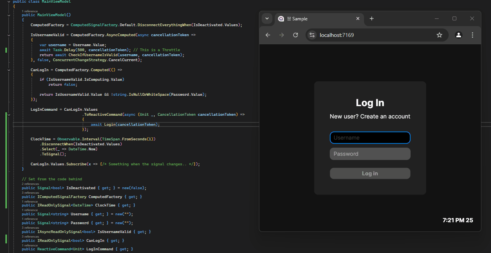

# SignalsDotnet

[](https://www.nuget.org/packages/SignalsDotnet)
[](https://www.nuget.org/packages/SignalsDotnet.Blazor)
[](LICENSE)

**Fine-grained reactive state for .NET.** Wrap a value in a signal, read it inside a computation, and the computation re-runs by itself whenever that value changes — no manual subscriptions, no `PropertyChanged` plumbing, no dependency lists to keep in sync.

Signals are built on [R3](https://github.com/Cysharp/R3) (a modern ReactiveX implementation), so every signal is also an `Observable<T>` and the whole Rx operator set stays available to you.

## A signal in three lines

```c#
var firstName = new Signal<string>("Ada");
var lastName = new Signal<string>("Lovelace");
var fullName = Signal.Computed(() => $"{firstName.Value} {lastName.Value}");

Console.WriteLine(fullName.Value); // Ada Lovelace
firstName.Value = "Grace";
Console.WriteLine(fullName.Value); // Grace Lovelace
```

`fullName` discovered its own dependencies simply by reading them. Nothing declared that it depends on `firstName`.

## In a XAML app



## In a Blazor app

```razor
@page "/counter"

@using SignalsDotnet
@using R3
@using SignalsDotnet.Blazor

<TrackedScope>
    <div>
        <h1>Counter</h1>
        <p>
            Count: @_count.Value <br />
        </p>
        
        <TrackedScope>
            <p>Now: @_now.Value</p>
        </TrackedScope>

        <button class="btn btn-primary"
                @onclick="() => _count.Value++">
            Click me
        </button>
    </div>
</TrackedScope>

@code {
    readonly CancellationDisposable _cd = new();
    readonly Signal<int> _count = new(0);
    IReadOnlySignal<DateTime> _now = null!;

    protected override void OnInitialized()
    {
        _now = Observable
            .Interval(TimeSpan.FromSeconds(1))
            .Select(_ => DateTime.Now)
            .TakeUntil(_cd.Token)
            .ToSignal();
    }
}
```

## Table of Contents

- [Get Started](#get-started)
- [Core Concepts](#core-concepts)
- [Source Generator](#source-generator)
  - [Computed and Async Properties](#computed-and-async-properties)
  - [ModelChanged](#modelchanged)
  - [Records](#records)
  - [Serialization](#serialization)
- [Basic Examples](#basic-examples)
- [Signal Types](#signal-types)
  - [Signal&lt;T&gt;](#signalt)
  - [CollectionSignal&lt;TObservableCollection&gt;](#collectionsignaltobservablecollection)
  - [DictionarySignal&lt;TKey, TValue&gt;](#dictionarysignaltkey-tvalue)
  - [Factory Methods](#factory-methods)
- [Computed Signals & Linked Signals](#computed-signals--linked-signals)
  - [Creating Computed Signals](#creating-computed-signals)
  - [Linked Signals](#linked-signals)
  - [Async Computed Signals](#async-computed-signals)
  - [Using ComputedSignalFactory](#using-computedsignalfactory)
  - [ConcurrentChangeStrategy](#concurrentchangestrategy)
  - [How it Works](#how-it-works)
- [Effects](#effects)
  - [Synchronous Effects](#synchronous-effects)
  - [Asynchronous Effects](#asynchronous-effects)
  - [Atomic Operations](#atomic-operations)
  - [Custom Schedulers](#custom-schedulers)
- [Advanced Features](#advanced-features)
  - [Untracked](#untracked)
  - [Signal Events](#signal-events)
  - [WhenAnyChanged](#whenanychanged)
  - [CancellationSignal](#cancellationsignal)
- [Subscription Strategies](#subscription-strategies)
- [Blazor Integration](#blazor-integration)
  - [TrackedScope Component](#trackedscope-component)
  - [Inspiration](#inspiration)

---

# Get Started

Adoption is incremental. Hold state in signals instead of plain fields and properties, read those signals wherever you derive something from them, and the derivations keep themselves current. There is no container to configure and no framework to buy into — signals are ordinary objects you can introduce one at a time.

Every signal also implements `INotifyPropertyChanged`.

## Core Concepts

### Signal Types

| Type | Role |
|---|---|
| `Signal<T>` | Writable signal holding a value of type `T` |
| `IReadOnlySignal<T>` | Read-only signal — computed or readonly |
| `IAsyncReadOnlySignal<T>` | Read-only signal backed by an async computation |
| `ISignal<T>` | Writable signal interface, used by linked signals |
| `IAsyncSignal<T>` | Writable signal backed by an async computation |
| `CollectionSignal<T>` | Signal wrapping an `ObservableCollection` |
| `DictionarySignal<TKey, TValue>` | Reactive dictionary with per-key tracking |

### Key Features

- **Runs Everywhere** — MAUI, WPF, Avalonia, Uno Platform, Blazor, Unity, Godot, and plain .NET
- **Automatic Dependency Tracking** — dependencies are discovered as they are read, not declared
- **Computed Signals** — derived values that stay in sync by themselves
- **Async Support** — asynchronous computations with cancellation and concurrency control
- **Deep Collection Reactivity** — collection signals react to the collection *and* to what is inside it
- **Effects** — side effects that re-run when the signals they touch change
- **Signal Events** — notifications that fire even when the value is unchanged
- **Full Rx Power** — every signal is an `Observable`, so the entire R3/ReactiveX ecosystem applies
- **Leak Resistant** — weak subscriptions and ref-counting keep long-lived sources from pinning objects alive
- **Source Generator** — declare partial properties, skip the boilerplate

---

## Source Generator

Declaring signals by hand gets repetitive. Mark a partial class with `[GenerateSignals]`, declare partial auto properties, and the generator backs each one with a `Signal<T>`:

```c#
[GenerateSignals]
public partial class Person
{
    public partial string Name { get; set; }
    public partial int Age { get; set; }
}
```

`Name` and `Age` now read and write like ordinary properties, but they are signals underneath — assigning to them notifies anything that depends on them. For each property you also get a `{Name}Signal` member exposing the underlying `IReadOnlySignal<T>`, for when you need the signal itself rather than its value:

```c#
var person = new Person { Name = "Ada", Age = 36 };

var summary = Signal.Computed(() => $"{person.Name} is {person.Age}");

person.Age = 37;                          // summary recomputes
person.AgeSignal.Values.Subscribe(Print); // the signal behind the property
```

### Computed and Async Properties

The same class can declare derived properties. A method named `Compute<PropertyName>` marked `[Computed]` generates the property it computes, and `[AsyncComputed]` does the same for work that takes a `CancellationToken`:

```c#
[GenerateSignals]
[GenerateNotifyPropertyChanged]
public partial class Person
{
    public partial string Name { get; set; }
    public partial int Age { get; set; }

    [Computed]
    string ComputeFullName() => $"{Name} {Age}";

    [AsyncComputed(ConcurrentChangeStrategy = ConcurrentChangeStrategy.CancelCurrent)]
    async ValueTask<bool> ComputeIsAdult(CancellationToken token)
    {
        await Task.Delay(100, token);
        return Age >= 18;
    }
}
```

That yields:

| Member | From | Notes |
|---|---|---|
| `Name`, `Age` | partial properties | read/write, backed by signals |
| `NameSignal`, `AgeSignal` | partial properties | `IReadOnlySignal<T>` access |
| `FullName` + `FullNameSignal` | `[Computed] ComputeFullName()` | method must be named `Compute<PropertyName>` |
| `IsAdult` + `IsAdultSignal` + `IsIsAdultComputing` | `[AsyncComputed]` | takes a `CancellationToken`, returns `Task<T>`/`ValueTask<T>` |
| `ModelChanged` | all writable signals | `IReadOnlySignal<Person>` that re-emits the instance on any change |
| `PropertyChanged` | `[GenerateNotifyPropertyChanged]` | optional; pass `false` to disable |

Other attributes: `[Signal]` backs a single property without annotating the class, and `[SignalIgnore]` excludes one.

Implement `partial void OnInitialized()` to run logic after the generated signals are ready.

### ModelChanged

A computed signal that tracks every writable signal property and yields the model itself, so it re-emits whenever any of them changes:

```c#
person.ModelChanged.Values.Subscribe(p => Console.WriteLine(p));

var revision = Signal.Computed(() =>
{
    _ = person.ModelChanged.Value;
    return DateTime.UtcNow;
});
```

Computed and async computed properties are not tracked, since they derive from the same signals. It is not generated for structs, or when a `ModelChanged` member already exists.

### Records

Records are supported and keep their value semantics: the generator emits `PrintMembers`, `Equals`, `GetHashCode`, and a copy constructor that use **only the data properties**, so signals stay out of `ToString()` and equality, and `with` produces an independent copy.

```c#
[GenerateSignals]
public partial record Person
{
    public partial string Name { get; set; }
    public partial int Age { get; set; }
}

var a = new Person { Name = "Ada", Age = 36 };
Console.WriteLine(a);            // Person { Name = Ada, Age = 36 }
Console.WriteLine(a == new Person { Name = "Ada", Age = 36 });  // True

var older = a with { Age = 40 }; // independent copy, a.Age is still 36
```

Positional records (primary constructors) are not supported and report `SIG011`, because their generated properties and constructor conflict with the generated ones. `record struct` is supported, except that `with` copies signal references rather than cloning them.

### Serialization

All generated members carry `[IgnoreDataMember]` and `[JsonIgnore]`, so only the data properties are serialized and DTOs round-trip:

```c#
var json = JsonSerializer.Serialize(new Person { Name = "Ada", Age = 36 });
// {"Name":"Ada","Age":36}
var restored = JsonSerializer.Deserialize<Person>(json);
```

`[JsonIgnore]` is only emitted when `System.Text.Json` is available in the consuming project.

---

## Basic Examples

### A form that validates itself

`CanLogin` recomputes on every keystroke in either field, with nothing wiring the two together:

```c#
public class LoginViewModel
{
    public Signal<string> Username { get; } = new();
    public Signal<string> Password { get; } = new();
    public IReadOnlySignal<bool> CanLogin { get; }

    public LoginViewModel()
    {
        CanLogin = Signal.Computed(() => !string.IsNullOrWhiteSpace(Username.Value)
                                      && !string.IsNullOrWhiteSpace(Password.Value));
    }
}
```

Commands can ride along on that signal. The pattern below is Prism's `DelegateCommand`, but any MVVM framework works the same way:

```c#
public static T RaiseCanExecuteChangedAutomatically<T>(this T @this) where T : DelegateCommand
{
    var signal = Signal.Computed(@this.CanExecute, config => config with { SubscribeWeakly = false });
    signal.Subscribe(_ => @this.RaiseCanExecuteChanged());
    _ = signal.Value;
    return @this;
}
```

### Async validation that cancels itself

The factory applies one deactivation trigger and one error handler to everything it creates. `IsUsernameValid` re-runs when `Username` changes — cancelling the previous request — and `IsComputing` lets the UI disable the button while it is in flight:

```c#
public class LoginViewModel
{
    public Signal<bool> IsDeactivated { get; } = new(false);
    public Signal<string?> Username { get; } = new("");
    public Signal<string> Password { get; } = new("");
    public IAsyncReadOnlySignal<bool> IsUsernameValid { get; }
    public IReadOnlySignal<bool> CanLogin { get; }

    public LoginViewModel()
    {
        var factory = ComputedSignalFactory.Default
            .DisconnectEverythingWhen(IsDeactivated.Values)
            .OnException(exception => Logger.LogError(exception, "Computation failed"));

        IsUsernameValid = factory.AsyncComputed(
            async token => await IsUsernameValidAsync(Username.Value, token),
            false,
            ConcurrentChangeStrategy.CancelCurrent);

        CanLogin = factory.Computed(() => !IsUsernameValid.IsComputing.Value
                                       && IsUsernameValid.Value
                                       && !string.IsNullOrWhiteSpace(Password.Value));
    }

    async Task<bool> IsUsernameValidAsync(string? username, CancellationToken token)
    {
        await Task.Delay(3000, token);
        return username?.Length > 2;
    }
}
```

### Reactivity through nested collections

`YoungestPerson` recomputes when a city, house, room, or person is added or removed **and** when any single person's `Age` changes — four levels down, with no subscription code:

```c#
public class YoungestPersonViewModel
{
    public CollectionSignal<ObservableCollection<City>> Cities { get; } = new();
    public IReadOnlySignal<PersonCoordinates?> YoungestPerson { get; }

    public YoungestPersonViewModel()
    {
        YoungestPerson = Signal.Computed(() =>
        {
            var people = from city in Cities.Value.EmptyIfNull()
                         from house in city.Houses.Value.EmptyIfNull()
                         from room in house.Rooms.Value.EmptyIfNull()
                         from person in room.People.Value.EmptyIfNull()
                         select new PersonCoordinates(person, room, house, city);

            return people.DefaultIfEmpty().MinBy(x => x?.Person.Age.Value);
        });
    }
}

public class City   { public CollectionSignal<ObservableCollection<House>>  Houses { get; } = new(); }
public class House  { public CollectionSignal<ObservableCollection<Room>>   Rooms  { get; } = new(); }
public class Room   { public CollectionSignal<ObservableCollection<Person>> People { get; } = new(); }
public class Person { public Signal<int> Age { get; } = new(); }

public record PersonCoordinates(Person Person, Room Room, House House, City City);
```

---

## Signal Types

Every signal exposes `Values`, an `Observable<T>` that emits the current value and then every change. `FutureValues` is the same stream without the current value, for when you only care about what happens next.

### `Signal<T>`

The workhorse: a writable box around a `T`. It raises `PropertyChanged` when the value changes.

```c#
// Basic signal
public Signal<Person> Person { get; } = new();

// Signal with custom equality comparer
public Signal<Person> Person2 { get; } = new(config => config with 
{ 
    Comparer = new CustomPersonEqualityComparer() 
});

// Signal with initial value
public Signal<string> Username { get; } = new("initial value");

// Signal that always raises PropertyChanged (even for same values)
public Signal<int> Counter { get; } = new(config => config with 
{ 
    RaiseOnlyWhenChanged = false 
});
```

**Configuration Options:**
- `Comparer` — custom `IEqualityComparer<T>` deciding what counts as a change
- `RaiseOnlyWhenChanged` — raise `PropertyChanged` only on an actual change (default: `true`)
- `SubscribeWeakly` — hold upstream subscriptions weakly (default: `false`)
- `SubscriptionStrategy` — when the upstream subscription is active; see [Subscription Strategies](#subscription-strategies)

**Changing Global Defaults:**

Defaults apply to every signal created afterwards, so set them once at startup:

```c#
// Set new global defaults
ReadonlySignalConfiguration.Default = new(
    RaiseOnlyWhenChanged: true,
    SubscribeWeakly: true,
    SubscriptionStrategy: SubscriptionStrategy.RefCount
);

// All new signals will use these defaults
var signal = new Signal<int>();
var linkedSignal = Observable.Interval(TimeSpan.FromSeconds(1)).ToSignal();
```

### `CollectionSignal<TObservableCollection>`

Wraps an `ObservableCollection` (or any `INotifyCollectionChanged`) and listens on two channels at once:

1. Replacement of the collection itself, through the `Value` property
2. Mutation of its contents — `Add`, `Remove`, `Clear`, and the rest

That second channel is what makes deep reactivity work: a computed signal reading such a collection recomputes when items come and go, and — if the items themselves hold signals — when their properties change. Example 3 above walks four levels of this.

```c#
// Basic collection signal
public CollectionSignal<ObservableCollection<Person>> People { get; } = new();

// Collection signal with throttling to batch notifications
public CollectionSignal<ObservableCollection<Person>> People { get; } = new(
    collectionChangedConfiguration: config => config.ThrottleOneCycle(UIReactiveScheduler)
);
```

**Why throttle?** A call like `AddRange()` fires one `CollectionChanged` event per item, and each one would otherwise trigger a recomputation. Throttling collapses the burst into a single notification per UI frame.

**Configuration Options:**
- `collectionChangedConfiguration` — how collection change events are processed (throttling, filtering, …)
- `propertyChangedConfiguration` — the signal's own property-changed behavior
- `SubscribeWeakly` — subscribe to collection events weakly to avoid pinning the collection (default: `false`)

### `DictionarySignal<TKey, TValue>`

Implements `IDictionary<TKey, TValue>` with tracking at the granularity of individual keys. A computed signal that reads `Scores["player1"]` depends on that key alone — writes to any other key leave it untouched.

```c#
public class ViewModel
{
    public DictionarySignal<string, int> Scores { get; } = new();
    
    public ViewModel()
    {
        Scores["player1"] = 100;
        Scores["player2"] = 150;
        
        var player1Score = Signal.Computed(() => 
        {
            return Scores.TryGetValue("player1", out var score) ? score : 0;
        });
        
        Scores["player1"] = 200;
    }
}
```

**Key Features:**

**Fine-Grained Key Tracking**: subscriptions follow the keys actually read on the last run. Below, flipping `useA` moves the dependency from `"a"` to `"b"` and the stale one is released:

```c#
var dictionary = new DictionarySignal<string, int>();
dictionary["a"] = 1;
dictionary["b"] = 2;

var useA = new Signal<bool>(true);
var score = Signal.Computed(() => 
{
    return useA.Value ? dictionary["a"] : dictionary["b"];
});

_ = score.Value;
useA.Value = false;
```

**Reactive Views**: `Keys`, `Values`, and `Count` are tracked as well:

```c#
var keyCount = Signal.Computed(() => dictionary.Keys.Count);

var totalScore = Signal.Computed(() => dictionary.Values.Sum());
```

**Operations**: the full `IDictionary` surface works, and every mutation is reactive:

```c#
dictionary.Add("player3", 75);
dictionary.Remove("player1");
dictionary.ContainsKey("player2");
dictionary.Clear();

dictionary["player3"] = 200;
```

**Memory Efficient**: because per-key subscriptions are dropped as soon as a computation stops reading that key, dictionaries with churning or unbounded key sets do not accumulate dead trackers.

### Factory Methods

```c#
// Create signals using factory methods
var signal = Signal.Create<string>();
var signalWithValue = Signal.Create("initial");

// Convert Observable to Signal
Observable<int> observable = /* ... */;
IReadOnlySignal<int> signal = observable.ToSignal();
ISignal<int> linkedSignal = observable.ToLinkedSignal();

// Create collection signal from existing collection
ObservableCollection<Person> collection = new();
IReadOnlySignal<ObservableCollection<Person>> signal = collection.ToCollectionSignal();

// Create from observable with configuration
var signal = Observable.Interval(TimeSpan.FromSeconds(1))
                       .ToSignal(config => config with { RaiseOnlyWhenChanged = false });

// Create with ref-count subscription strategy (unsubscribe when no listeners)
var refCountSignal = Observable.Interval(TimeSpan.FromSeconds(1))
                               .ToSignal(config => config with { SubscriptionStrategy = SubscriptionStrategy.RefCount });
```

---

## Computed Signals & Linked Signals

A computed signal is a value defined by an expression rather than by assignment. It watches whatever that expression reads and recomputes when any of it changes. Computed signals are ref-counted by default, so an unobserved one does no work at all — see [Subscription Strategies](#subscription-strategies).

### Creating Computed Signals

```c#
var firstName = new Signal<string>("John");
var lastName = new Signal<string>("Doe");

// Automatically updates when firstName or lastName changes
var fullName = Signal.Computed(() => $"{firstName.Value} {lastName.Value}");

Console.WriteLine(fullName.Value); // "John Doe"
firstName.Value = "Jane";
Console.WriteLine(fullName.Value); // "Jane Doe"
```

### Linked Signals

A linked signal is computed, but you can also write to it. The manual value holds until the source changes, at which point the computation takes over again:

```c#
var source = new Signal<int>(10);
var linked = Signal.Linked(() => source.Value * 2);

Console.WriteLine(linked.Value); // 20

// Can be manually overridden
linked.Value = 100;
Console.WriteLine(linked.Value); // 100

// Automatically recomputes when source changes
source.Value = 5;
Console.WriteLine(linked.Value); // 10
```

### Async Computed Signals

```c#
var username = new Signal<string>();

var isUsernameValid = Signal.AsyncComputed(
    async cancellationToken => 
    {
        var user = username.Value;
        return await ValidateUsernameAsync(user, cancellationToken);
    },
    defaultValue: false,
    ConcurrentChangeStrategy.CancelCurrent
);

// Check if computation is running
if (isUsernameValid.IsComputing.Value)
{
    Console.WriteLine("Validating...");
}
```

### Using ComputedSignalFactory

`ComputedSignalFactory` lets you apply one policy — error handling, a deactivation trigger, a scheduler — to a whole group of signals instead of repeating it at each call site:

```c#
public class LoginViewModel
{
    public Signal<bool> IsDeactivated { get; } = new(false);

    public LoginViewModel()
    {      
        var computedFactory = ComputedSignalFactory.Default
            .DisconnectEverythingWhen(IsDeactivated.Values)
            .OnException(exception =>
            {
                Logger.LogError(exception, "Computation error");
            });

        // All signals created from this factory will be cancelled when IsDeactivated is true
        IsUsernameValid = computedFactory.AsyncComputed(
            async cancellationToken => await IsUsernameValidAsync(Username.Value, cancellationToken),
            false, 
            ConcurrentChangeStrategy.CancelCurrent
        );

        CanLogin = computedFactory.Computed(() => 
            !IsUsernameValid.IsComputing.Value &&
            IsUsernameValid.Value &&
            !string.IsNullOrWhiteSpace(Password.Value)
        );

        // Effects are also created from the factory
        computedFactory.Effect(UpdateApiCalls);
    }

    public Signal<string?> Username { get; } = new();
    public Signal<string> Password { get; } = new();
    public IAsyncReadOnlySignal<bool> IsUsernameValid { get; }
    public IReadOnlySignal<bool> CanLogin { get; }

    async Task<bool> IsUsernameValidAsync(string? username, CancellationToken cancellationToken)
    {
        await Task.Delay(3000, cancellationToken);
        return username?.Length > 2;
    }

    void UpdateApiCalls()
    {
        // Effect logic here
    }
}
```

### ConcurrentChangeStrategy

An async computation takes time, and a dependency may change before it finishes. `ConcurrentChangeStrategy` says what to do about it:

- **`CancelCurrent`** — cancel the in-flight computation and restart immediately. Right for validation and search-as-you-type, where only the latest result matters.
- **`ScheduleNext`** — let the current run finish, then run once more (at most one queued). Right when the computation has side effects or must not be interrupted.

Either way, `DisconnectEverythingWhen` cancellation still applies.

### How it Works

There is no magic in the dependency tracking, just bookkeeping around the `Value` getter:

1. Before running the computation, the signal installs itself as the current tracker
2. Every `Value` getter that runs reports itself to that tracker
3. When the computation returns, the signal subscribes to exactly the signals that reported in
4. Any of them changing re-runs the computation, which re-collects the dependency set from scratch

Because the set is rebuilt each run, dependencies follow your control flow. A branch that wasn't taken creates no subscription, and a dependency abandoned on the latest run is released.

---

## Effects

An effect tracks dependencies exactly like a computed signal, but produces no value — it exists for what it *does*. Reach for one when the reaction to a change is logging, navigation, persistence, or a call out to something else.

### Synchronous Effects
```c#
public class ViewModel
{
    public Signal<int> Counter { get; } = new();
    
    public ViewModel()
    {
        // Effect runs immediately and re-runs whenever Counter changes
        var effect = new Effect(() => 
        {
            Console.WriteLine($"Counter value: {Counter.Value}");
        });
    }
}
```

### Asynchronous Effects
```c#
public class ViewModel
{
    public Signal<string> SearchTerm { get; } = new();
    
    public ViewModel()
    {
        var effect = new Effect(async cancellationToken =>
        {
            var term = SearchTerm.Value;
            await SearchAsync(term, cancellationToken);
        }, ConcurrentChangeStrategy.CancelCurrent);
    }
}
```

### Atomic Operations

Writing several signals in a row would normally run dependent effects once per write, including on the inconsistent intermediate states. Wrap the writes in an atomic operation and effects run once, at the end:

```c#
Effect.AtomicOperation(() =>
{
    signal1.Value = 1;
    signal2.Value = 2;
    signal3.Value = 3;
    // Effect runs only once after all changes
});

// Async version
await Effect.AtomicOperationAsync(async () =>
{
    await Task.Yield();
    signal1.Value = 1;
    await Task.Yield();
    signal2.Value = 2;
    // Effect runs only once after all changes
});
```

### Custom Schedulers

Pass a scheduler to control where and when the effect body runs — useful for marshalling to a UI thread or coalescing to a frame:

```c#
var scheduler = TimeProvider.System;
var effect = new Effect(() => 
{
    // This will be scheduled on the specified scheduler
    DoSomething();
}, scheduler);
```

---

## Advanced Features

### Untracked

Sometimes a computation needs to *read* a signal without *depending* on it. `Signal.Untracked()` and the `UntrackedValue` shortcuts read the current value while staying invisible to the tracker:

```c#
public class LoginViewModel
{
   public LoginViewModel()
   {
       // Using Untracked() method
       CanLogin = Signal.Computed(() =>
       {
           return !string.IsNullOrWhiteSpace(Username.Value) && 
                  Signal.Untracked(() => !string.IsNullOrWhiteSpace(Password.Value));
       });
       
       // Using UntrackedValue property
       CanLogin = Signal.Computed(() => !string.IsNullOrWhiteSpace(Username.Value) && 
                                       !string.IsNullOrWhiteSpace(Password.UntrackedValue));

       // For collection signals
       var anyPeople = Signal.Computed(() => People.UntrackedValue);
       var anyPeople2 = Signal.Computed(() => People.UntrackedCollectionChangedValue);
   }

   public CollectionSignal<ObservableCollection<Person>> People { get; } = new();
   public Signal<string> Username { get; } = new();
   public Signal<string> Password { get; } = new();
   public IReadOnlySignal<bool> CanLogin { get; }
}
```

### Signal Events

A signal event notifies on every `Invoke()`, even when nothing about the value changed. Use it for things that *happen* rather than things that *are* — a refresh request, a submitted command, a tick:

```c#
public class ViewModel
{
    public ISignal<Unit> RefreshRequested { get; } = Signal.CreateEvent();
    
    public void RequestRefresh()
    {
        RefreshRequested.Invoke(); // Always triggers notification
    }
    
    public ViewModel()
    {
        var effect = new Effect(() =>
        {
            RefreshRequested.Track(); // Track the event
            // This runs every time Invoke() is called
            PerformRefresh();
        });
    }
}
```

### WhenAnyChanged

Merge several signals into one observable that fires whenever any of them changes, regardless of their types:

```c#
var signal1 = new Signal<int>();
var signal2 = new Signal<string>();
var signal3 = new Signal<bool>();

Observable<Unit> anyChanged = Signal.WhenAnyChanged(signal1, signal2, signal3);
anyChanged.Subscribe(_ => Console.WriteLine("At least one signal changed"));
```

### CancellationSignal

Turns a boolean observable into a signal of `CancellationToken`s: each time the flag goes true, the current token is cancelled and a fresh one takes its place. Handy for tying async work to a lifecycle such as view deactivation:

```c#
Observable<bool> isDeactivated = this.IsDeactivated();
IReadOnlySignal<CancellationToken> cancellationSignal = CancellationSignal.Create(isDeactivated);

// Use the cancellation token in async operations
await SomeAsyncOperation(cancellationSignal.Value);
```

---


## Subscription Strategies

`SubscriptionStrategy` controls how long a computed or observable-backed signal stays subscribed to its source:

- **`Persistent`** (default) — subscribes once on first value access and keeps that subscription for the signal's lifetime. Pick it when the signal must not miss anything while unobserved, or when re-subscribing to the source is expensive.
- **`RefCount`** (opt-in) — subscribes while at least one observer is listening to `Values`/`FutureValues`, and unsubscribes when the last one goes away. An unobserved signal costs nothing, and a re-observed one starts up again. This propagates: when a ref-counted computed goes idle it releases its dependencies, so a whole derived graph can wind down behind a closed view.

```c#
var signal = Signal.Computed(() => a.Value + b.Value,
                             config => config with { SubscriptionStrategy = SubscriptionStrategy.RefCount });

var ticking = Observable.Interval(TimeSpan.FromSeconds(1))
                        .ToSignal(config => config with { SubscriptionStrategy = SubscriptionStrategy.RefCount });
```

Defaults can be changed globally:

```c#
ReadonlySignalConfiguration.Default = ReadonlySignalConfiguration.Default with
{
    SubscriptionStrategy = SubscriptionStrategy.RefCount
};
```

> With `RefCount`, a signal is inert until something observes it, and while idle its value is whatever it last saw. Subscribe to `Values` (not only `FutureValues`) to activate it and get the current value. In XAML and Blazor this is automatic — a binding or a `TrackedScope` is itself an observer.

---

## Blazor Integration

The `SignalsDotnet.Blazor` package lets components re-render on their own when the signals they read change.

### TrackedScope Component

`TrackedScope` marks a reactive region of markup. Every signal read through `.Value` while that region renders becomes a dependency of it, and a change to any of them re-renders that region alone rather than the whole component. Scopes nest, so you can keep a frequently-changing value from invalidating everything around it. Updates are dispatched via `InvokeAsync(StateHasChanged)`, so they land on the right `SynchronizationContext`.

```razor
<TrackedScope>
    <p>Current count is: @_count.Value</p>
</TrackedScope>
```

### Inspiration

This Blazor signal integration is inspired by **Steven Giesel**'s excellent blog post, [Signals in Blazor](https://steven-giesel.com/blogPost/495d87ca-61df-4c52-a253-8ba4abc186b7).

---

## License

This project is licensed under the terms specified in the [LICENSE](LICENSE) file.

## Contributing

Contributions are welcome! Please feel free to submit issues or pull requests.

## Repository

GitHub: https://github.com/fedeAlterio/SignalsDotnet
